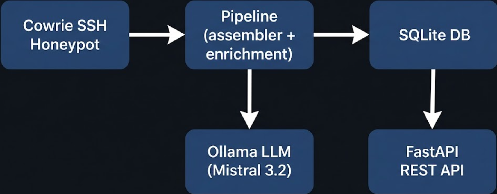

# Honeypot Threat Intelligence Feed

Public, AI-assisted SSH honeypot threat intelligence API with STIX 2.1 output and MITRE ATT&CK mappings.

[API](https://threat-intel.101904.xyz) · [Docs](https://threat-intel.101904.xyz/docs) · [OpenAPI](https://threat-intel.101904.xyz/openapi.json)

Runbooks: [Production](./docs/PRODUCTION.md) · [Architecture](./docs/ARCHITECTURE.md) · [Security](./SECURITY.md)

## Overview

This project ingests Cowrie SSH honeypot logs and turns raw attacker activity into structured threat intelligence.

Pipeline:
1. Assemble raw Cowrie events into full attacker sessions
2. Classify behavior using a local LLM (Mistral Small 3.2 via Ollama) with deterministic fallback logic
3. Map sessions to MITRE ATT&CK techniques
4. Publish indicators as JSON/CSV/STIX 2.1

No API key required. Current rate limit: 100 req/min.

## Quick Start

```bash
# Latest indicators
curl -s https://threat-intel.101904.xyz/api/v1/feed?since=24h | jq .

# STIX bundle
curl -s https://threat-intel.101904.xyz/api/v1/feed/stix -o threat-intel.json

# CSV export
curl -s "https://threat-intel.101904.xyz/api/v1/feed?format=csv&since=7d" -o indicators.csv

# Sessions
curl -s https://threat-intel.101904.xyz/api/v1/sessions?limit=10 | jq .

# Stats
curl -s https://threat-intel.101904.xyz/api/v1/stats | jq .
```

## API Endpoints

| Method | Path | Purpose |
|---|---|---|
| GET | `/api/v1/feed` | Indicator feed (JSON, CSV, STIX) |
| GET | `/api/v1/feed/stix` | Full STIX 2.1 bundle |
| GET | `/api/v1/indicators` | Paginated indicator list |
| GET | `/api/v1/indicators/{value}` | Lookup by indicator value |
| GET | `/api/v1/sessions` | Paginated session list |
| GET | `/api/v1/sessions/{id}` | Session detail + STIX context |
| GET | `/api/v1/stats` | Aggregate statistics |
| GET | `/api/v1/quality` | 24h operational quality metrics + feed freshness |
| GET | `/api/v1/limitations` | Machine-readable trust/limitations policy |
| GET | `/api/v1/health` | Health check |
| GET | `/api/v1/startup-check` | Runtime self-check (schema + pipeline state) |
| GET | `/api/v1/integrity` | STIX bundle integrity hash and feed counters |
| GET | `/api/v1/feed/revoked` | Revoked indicators feed |
| GET | `/taxii2/` | TAXII 2.1 discovery |
| GET | `/taxii2/collections` | TAXII collection metadata |
| GET | `/taxii2/collections/{id}/objects` | TAXII STIX objects |
| GET | `/api/v1/about` | Methodology and data policy |
| GET | `/docs` | Swagger UI |
| GET | `/openapi.json` | OpenAPI schema |

### Supported Filters

- `since`: `1h`, `24h`, `7d`, ISO-8601 timestamp, or Unix epoch
- `type`: `ipv4-addr`, `url`, `file-hash`, `all`
- `threat_level`: `low`, `medium`, `high`, `critical`
- `attack_type`: `brute_force`, `credential_stuffing`, `recon`, `malware_deployment`, `cryptominer`, `botnet_recruitment`, `lateral_movement`, `data_exfil`, `unknown`
- `limit`/`offset`: pagination (max 1000 per page)

## Scoring Model

| Level | Confidence | Trigger |
|---|---:|---|
| `low` | 40 | Failed brute-force behavior only |
| `medium` | 65 | Successful auth + recon activity |
| `high` | 85 | Malware download or persistence behavior |
| `critical` | 95 | Cryptominer/C2/exploitation behavior |

## STIX 2.1 Notes

- Includes producer identity and `created_by_ref`
- Uses `TLP:CLEAR` marking
- Correct patterns for `ipv4-addr`, `url`, and SHA-256 file hashes
- Includes `observed-data`, `indicator`, `attack-pattern`, and `relationship` objects

## Architecture



## Data Handling

Collected:
- Source IPs
- Usernames (passwords redacted)
- Commands
- Malware URLs/hashes
- SSH client metadata

Not exposed:
- Internal infrastructure IPs/topology
- Raw passwords

## Self-Hosting

```bash
git clone https://github.com/Tristan1019-user/honeypot-threat-intel.git
cd honeypot-threat-intel

# Configure OLLAMA_URL and Cowrie log path in compose.yml
docker compose up -d

# Optional initial ingest
curl "http://localhost:8099/api/v1/pipeline/run?log_path=/cowrie/var/log/cowrie/cowrie.json"
```

## Requirements

- Docker + Docker Compose
- Cowrie (or compatible Cowrie JSON logs)
- Ollama (optional; fallback classification is built in)

## CI / Quality Gates

This repo includes GitHub Actions CI (`.github/workflows/ci.yml`) with:
- Ruff lint
- Mypy type check
- Pytest unit tests
- API smoke test (`/api/v1/health`, `/api/v1/quality`)

## Reproducible Deploy (CT103)

Use the deploy script (instead of ad-hoc manual edits):

```bash
./scripts/deploy_ct103.sh
```

This script:
1. Uploads app files to Proxmox
2. Pushes files into CT 103 stack path
3. Restarts `threat-intel-api` and verifies health

## License

MIT
